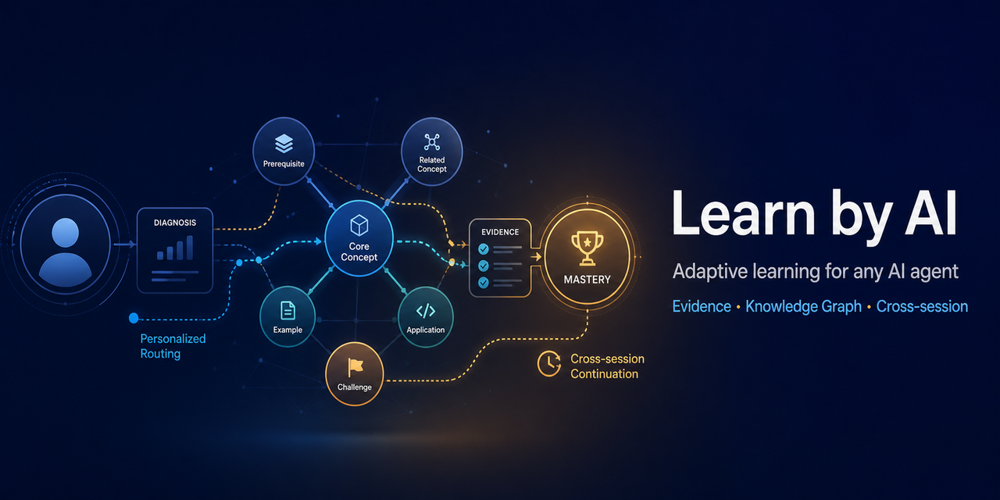
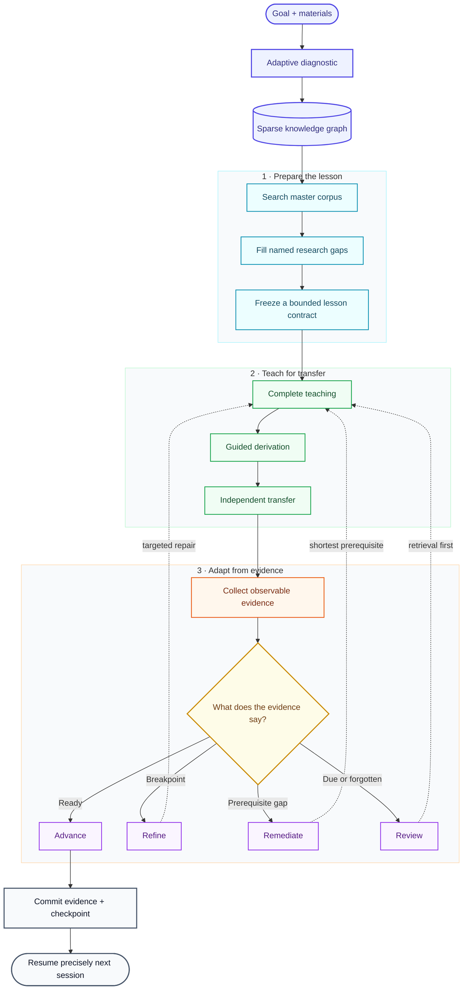

# Learn by AI — Adaptive learning for any AI agent



[](https://github.com/iyohesohoka646-dotcom/learn-by-ai/actions/workflows/validate.yml)
[](https://github.com/iyohesohoka646-dotcom/learn-by-ai/releases/latest)
[](LICENSE)
[](https://agentskills.io/)

**Turn Codex, Claude Code, Cursor, OpenCode, or another skills-compatible agent into an evidence-led adaptive tutor that remembers where learning stopped.**

普通 AI 导师会解释内容。Learn by AI 还会诊断、选路、获取掌握证据、定位最早断点，并把学习状态保存到下一次对话。

## Install in one command

Use the open Skills CLI to discover and install the skill across supported agents:

```bash
npx skills add iyohesohoka646-dotcom/learn-by-ai --skill learn-by-ai -g
```

Or use it once without installing:

```bash
npx skills use iyohesohoka646-dotcom/learn-by-ai@learn-by-ai
```

No Node.js? Download `learn-by-ai.skill` from the [latest release](https://github.com/iyohesohoka646-dotcom/learn-by-ai/releases/latest) for upload-based clients, or use the bundled Python installer:

```bash
git clone https://github.com/iyohesohoka646-dotcom/learn-by-ai.git
cd learn-by-ai
python install.py --target <your-agent-skills-directory>
```

Codex users can run `python install.py --codex`.

## See it in 30 seconds

Start with a goal:

```text
Use $learn-by-ai to help me learn probability distributions from my notes.
I want to distinguish random variables, distributions, densities, and point probabilities,
then apply them independently in simulation and modeling.
```

The skill then:

1. indexes accessible materials by role instead of loading everything;
2. asks a compact diagnostic question;
3. builds only the relevant knowledge graph and prerequisites;
4. searches the indexed master documents and extracts only the relevant sections;
5. adds targeted papers, official references, or strong explanatory sources;
6. freezes a bounded, flexible lesson contract with completion and stopping conditions;
7. teaches through complete explanation, guided derivation, and independent transfer;
8. chooses whether to advance, refine, remediate, or review;
9. records observable evidence rather than trusting “I understand”;
10. writes a checkpoint with exactly one opening question for the next session.

At the next conversation, the agent loads the checkpoint and continues from the unresolved reasoning step—not from a generic onboarding interview.

Explore the complete sample project: [`examples/probability-distribution`](examples/probability-distribution).

## Why it is different

| Typical AI tutoring | Learn by AI |
|---|---|
| Explains the requested topic | Selects the next goal-relevant node and teaches it fully |
| Treats “I understand” as progress | Requires observable mastery evidence |
| Repeats longer explanations after errors | Locates and repairs the earliest breakpoint |
| Loads materials opportunistically | Anchors teaching to a primary source and routes supplements by role |
| Searches indefinitely or cites whatever appears first | Searches the master corpus first, fills named gaps, then freezes a source pack |
| Uses a fixed script or lets the lesson sprawl | Uses a flexible lesson contract with explicit completion and detour rules |
| Gives exercises as the lesson | Uses complete teaching → guided derivation → independent transfer |
| Depends on chat memory | Commits durable, human-readable learning state |
| Starts over in a new conversation | Resumes from one precise checkpoint question |

## How the learning loop works



## Durable learning state

Each learning project stays inspectable and portable:

```text
learning-project/
├── project.yaml          # Goal, constraints, route, current node
├── resource-index.yaml   # Materials, roles, accessibility, locators
├── knowledge-graph.yaml  # Sparse concepts and typed relations
├── learner-state.yaml    # Multidimensional mastery and blockers
├── evidence.jsonl        # Append-only attempts and corrections
└── checkpoint.md         # Precise cross-session handoff
```

The skill stores summaries and source locators—not copyrighted textbooks or entire chapters.

## Compatibility and trust

- Portable `SKILL.md` format with only the required `name` and `description` frontmatter.
- No dedicated model, API, MCP server, database, vector store, or telemetry dependency; external research uses the host agent's existing search tools and degrades transparently when unavailable.
- Human-readable state; users can inspect, edit, archive, or delete it at any time.
- Non-destructive initializer and installer; both refuse to overwrite existing state.
- Windows, macOS, and Linux validation on every push.
- Optional Python 3 initializer; scriptless agents can use bundled templates with native file tools.

The installable runtime is [`skill/learn-by-ai`](skill/learn-by-ai). Optional OpenAI UI metadata is isolated in `agents/openai.yaml` and can be ignored by other clients.

## Prompts to try

```text
Use $learn-by-ai to design and run a six-week linear algebra learning program.
Use $learn-by-ai to continue from my saved checkpoint and test the due review first.
Use $learn-by-ai with these three textbooks, choosing each source by its role.
用 $learn-by-ai 根据我的目标和资料开始诊断，不要把“我懂了”直接当成掌握证据。
```

## Contribute

- Found a reproducible problem? [Open an issue](https://github.com/iyohesohoka646-dotcom/learn-by-ai/issues/new/choose).
- Have a teaching strategy or compatibility idea? Start a [Discussion](https://github.com/iyohesohoka646-dotcom/learn-by-ai/discussions).
- Tried it on a real learning goal? Share the goal, agent, first checkpoint, and what improved.

Run the full local validation:

```bash
python -m unittest discover -s tests -v
python scripts/build_release.py
```

## 中文简介

<details>
<summary>展开中文说明</summary>

Learn by AI 是一个面向通用 AI Agent 的长期自适应学习 Skill。每个新教学单元会先检索项目总文档，再针对明确缺口补充论文、官方资料或优质博客，并形成带完成条件和停止边界的弹性教学计划；随后以“完整讲授→共同推导→独立迁移”推进，根据学习证据调整路线。

它特别适合：系统课程、教材驱动学习、苏格拉底式教学、分层练习、长期复习，以及需要跨会话准确续接的学习项目。一次性事实问答或单题求解默认不会启动完整协议。

</details>

## License

[MIT](LICENSE)
