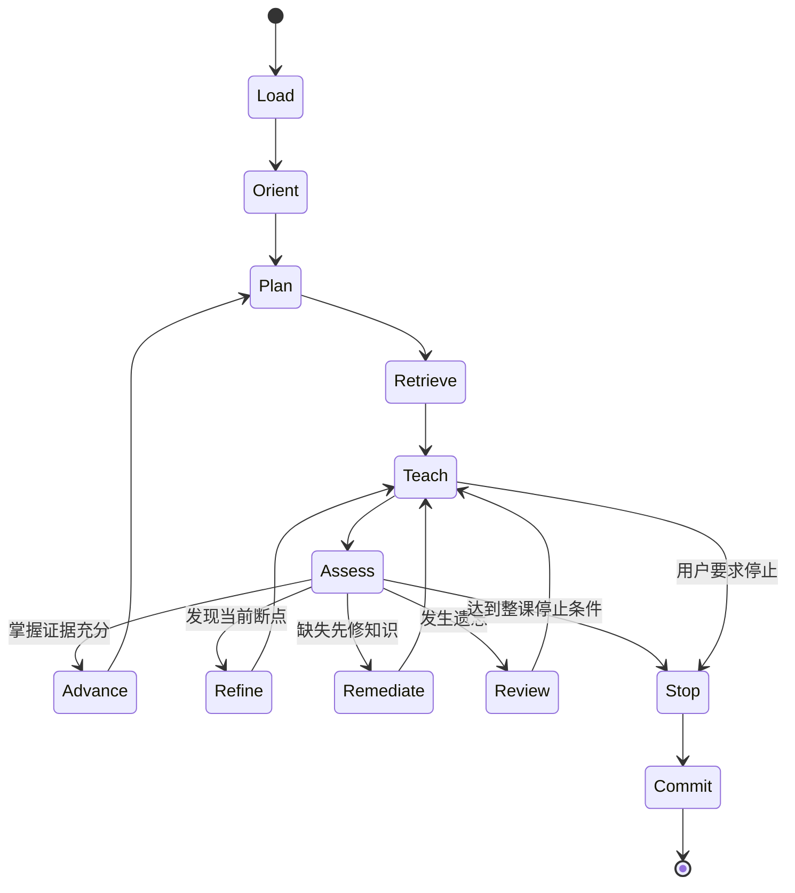

# Learn by AI — An Adaptive Learning Skill：设计规格

版本：1.0
定位：面向通用大模型的、基于显式知识图和学习状态的长期自适应教学协议。

## 1. 项目定位

本项目不重新实现 OCR、全文数据库、模型服务或全局记忆系统，而是规定通用 AI 在长期教学中：

1. 如何根据用户目标、上传资料和初始诊断建立知识图；
2. 如何选择下一学习节点和当前需要调用的资料；
3. 如何通过提问、讲解、做题和应用任务获取掌握证据；
4. 如何根据错误定位第一处推理断点并细化教学；
5. 如何判断局部暂停、单元完成和整课结束；
6. 如何记录证据、更新节点状态并在新对话中精确续接。

项目的核心产物不是一个独立 Agent，而是一套可安装、可检查、可移植的教学控制协议：

\[
\boxed{
\text{知识图}
+\text{学习者状态覆盖层}
+\text{证据日志}
+\text{教学控制规则}
}
\]

## 2. 设计原则

1. **显式状态优先**：关键进度不能只依赖模型的自动记忆。
2. **证据驱动**：掌握状态必须由可观察行为支持，不能因用户说“懂了”直接提升。
3. **静态知识与用户状态分离**：知识内容是共享的，掌握程度是每个用户独立的覆盖层。
4. **索引而非复制**：节点保存摘要和精确来源，不复制整本教材内容。
5. **选择性调用**：先判断需要哪类资料，再检索相关章节，不把全部资料塞入上下文。
6. **定位最早断点**：答错后细化第一处失败的推理台阶，不用更长的话重讲整章。
7. **允许未知**：未测试表示证据不足，不等于不会。
8. **可恢复**：每次课程结束都必须生成可在新对话直接恢复的检查点。
9. **渐进实现**：第一版只依赖 Skill 和结构化文件，不建设数据库、OCR 或自定义界面。

## 3. 总体模型

系统维护四个相互分离但彼此关联的对象。

### 3.1 知识图

知识图表示学习内容本身：

\[
G_K=(V,E).
\]

- \(V\)：知识节点；
- \(E\)：知识节点之间的有类型关系。

### 3.2 学习者状态覆盖层

同一知识图可对应不同用户。用户状态不直接写入共享知识节点，而以覆盖层保存：

\[
S_u:V\rightarrow \text{LearnerState}.
\]

### 3.3 证据日志

证据日志追加保存用户实际做过什么、答得怎样、使用了多少提示，以及哪一步出现问题。节点状态是证据日志的归纳结果，而不是证据本身。

### 3.4 教学控制策略

控制策略根据知识图、用户状态、目标、时间和当前对话决定下一动作：

\[
\pi(G_K,S_u,H_t,C_t)\rightarrow a_{t+1},
\]

其中：

- \(H_t\)：历史证据；
- \(C_t\)：当前课程上下文；
- \(a_{t+1}\)：检索、提问、讲解、练习、细化、复习、记录或停止。

## 4. 知识图节点设计

### 4.1 节点不应只有一个“掌握度”

一个学生可能会算标准题，却不会解释概念；也可能理解证明，却不会把方法用于数据。因此掌握状态必须是多维向量，而不是单一分数。

### 4.2 节点的静态字段

| 字段 | 含义 |
|---|---|
| `id` | 稳定、唯一的节点标识 |
| `name` | 规范名称 |
| `aliases` | 教材中的不同名称、译名和记号 |
| `type` | 概念、定理、方法、技能、模型或工具 |
| `summary` | 节点的最小知识摘要，不代替教材原文 |
| `scope` | 该节点包含什么、不包含什么 |
| `learning_objectives` | 学完后应能完成的可观察任务 |
| `prerequisites` | 必要先修节点 |
| `relations` | 与其他节点的类型化关系 |
| `source_refs` | 教材、章节、页码、题号和来源角色 |
| `assessment_refs` | 可用于诊断或验收的题目索引 |
| `common_misconceptions` | 常见误解及区分性问题 |
| `applications` | 工程、科研或现实应用 |
| `target_depth` | 当前学习目标要求的深度 |
| `goal_weight` | 对用户当前目标的重要程度 |
| `estimated_time` | 完成当前目标深度的大致时间 |
| `provenance` | 节点和边来自哪些资料或人工确认 |
| `confidence` | 建图结果的可信程度：低、中、高 |
| `version` | 节点定义和索引的版本 |

### 4.3 每个用户的动态字段

| 字段 | 含义 |
|---|---|
| `learning_status` | 未接触、诊断中、学习中、脆弱、稳定、待复习、阻塞 |
| `conceptual` | 能否解释对象、定义和理论动机 |
| `derivation` | 能否从定义或问题完成关键推导 |
| `standard_problem` | 能否独立解决标准题 |
| `transfer` | 条件改变后能否迁移方法 |
| `application` | 能否建模、解释数据或完成代码任务 |
| `oral_expression` | 能否清晰口述并应对追问 |
| `retention` | 间隔一段时间后能否提取和使用 |
| `evidence_strength` | 当前判断依据是弱、中还是强 |
| `attempt_refs` | 指向相关作答证据 |
| `error_profile` | 各类错误的频次与最近出现时间 |
| `hint_dependency` | 是否依赖提示以及提示层级 |
| `self_confidence` | 用户自我判断，用于比较信心与实际表现 |
| `last_seen` | 最近学习时间 |
| `last_assessed` | 最近有效测评时间 |
| `review_due` | 下一次应复习的时间或条件 |
| `blocked_by` | 当前尚未掌握的前置节点 |
| `recommended_action` | 继续、巩固、变式、补先修、应用或复习 |

掌握维度第一版使用 0—4 的离散等级，不使用看似精确但缺乏依据的小数：

| 等级 | 含义 | 最低证据 |
|---:|---|---|
| 0 | 未接触或证据不足 | 无 |
| 1 | 能识别和复述 | 能用自己的话说明基本含义 |
| 2 | 能处理标准任务 | 无强提示完成标准题 |
| 3 | 能解释条件并迁移 | 完成近邻变式并说明方法边界 |
| 4 | 能综合使用 | 证明、构造反例、建模或跨场景迁移 |

### 4.4 边类型

至少支持以下关系：

- `prerequisite-of`：先修关系；
- `part-of`：组成关系；
- `generalizes` / `specializes`：一般化与特殊化；
- `derived-from`：推导来源；
- `contrasts-with`：需要比较的相近概念；
- `commonly-confused-with`：常见混淆；
- `used-by`：被某方法、定理或模型使用；
- `applies-to`：应用到某类问题；
- `transfers-to`：可迁移到另一主题；
- `assessed-by`：由哪些任务测评。

每条重要边也应保存来源和置信度，避免模型把猜测的关联当成确定事实。

## 5. 建图与初始化流程

### 5.1 输入

初始化时收集：

1. 用户最终目标与时间范围；
2. 希望达到的深度：了解、考试、研究、工程或综合；
3. 已上传的教材、题集、笔记和考试资料；
4. 用户已知的基础和自我判断；
5. 一次小型自适应诊断的作答结果。

### 5.2 资料处理

第一版不实现 OCR 或全文入库，只使用当前平台可以读取的内容：

1. 登记文件身份、版本和可访问性；
2. 优先读取目录、索引、章节标题和少量代表性内容；
3. 为每本资料分配角色：主教材、严格深化、题库、应用、代码、考试；
4. 对不可访问或不可检索的资料明确标记，不假装已经核对；
5. 不把商业教材原文复制到公开仓库或知识节点。

### 5.3 候选知识图构建

1. 从用户目标和资料目录提取候选节点；
2. 合并同义词、不同译名和不同教材记号；
3. 建立先修、组成、对比、应用等关系；
4. 将节点对齐到用户目标，设置目标深度和优先级；
5. 保存每个节点和边的来源与置信度；
6. 对不确定关系保留为候选，不自动当成事实；
7. 允许用户检查和修订知识图。

### 5.4 小型自适应诊断

诊断不应穷举所有节点，而应选择能区分能力层级的锚点：

1. 从主干节点及关键先修节点抽样；
2. 先给中等难度问题；
3. 正确则向变式、解释或推导上探；
4. 错误则向定义、对象和先修知识下探；
5. 同时覆盖概念、计算、推导、迁移和口述；
6. 将未测试节点标为“未知”，而非“不会”；
7. 输出初始状态和不确定性，不做过度诊断。

诊断结束后形成：

- 已有能力锚点；
- 关键断点；
- 主线入口；
- 高风险先修节点；
- 第一阶段课程范围；
- 需要后续验证的未知节点。

## 6. 规则体系的重新组织

原先提出的“调用、停止、记录、细化”四类规则是正确的核心，但概括仍不充分：

1. “调用”混合了 Skill 触发、状态读取和教材检索，应拆开；
2. “记录”混合了原始证据、掌握判断和检查点写入，应拆开；
3. “停止”必须区分单轮等待、单元完成和整课结束；
4. “细化”必须以错误分类和第一处断点为依据；
5. 还缺少建图、下一节点选择、测评和复习规则。

优化后采用八类规则，分为三层。

### A. 初始化层

1. 建图规则；
2. 诊断与初始状态规则。

### B. 教学控制层

3. 触发与调用规则；
4. 规划与选路规则；
5. 教学与测评规则；
6. 细化与补救规则；
7. 停止与续接规则。

### C. 状态持久化层

8. 证据、状态更新、记录与复习规则。

## 7. 教学状态机



## 8. 触发与调用规则

### 8.1 Skill 触发

以下请求触发长期自适应学习模式：

- 开始系统学习某个主题；
- 依据一组资料制定并执行学习计划；
- 继续、复习或检查上次学习；
- 进行提问式教学或分层做题；
- 根据历史表现调整难度；
- 创建或更新长期个性化笔记。

一次性事实问答或单题求解默认不启动完整长期协议，除非用户明确要求纳入学习档案。

### 8.2 新对话恢复

新对话必须先读取：

1. 当前目标；
2. 当前知识图版本；
3. 当前节点和最近检查点；
4. 最近错误与未解决问题；
5. 本次到期复习节点；
6. 可用资料索引。

随后先向用户复述当前节点、遗留问题、本次目标和将调用的资料，再继续教学。

### 8.3 资料调用

| 需要 | 优先资料 |
|---|---|
| 标准定义和课程主线 | 主教材 |
| 定理条件和严格证明 | 深化教材 |
| 标准题和考试技巧 | 考试教材、真题 |
| 反例和探索 | 理论题集 |
| 建模、模拟和代码 | 应用与计算资料 |
| 模型比较 | 统计学习或领域专著 |

先在资料索引中筛选，再读取当前节点的精确章节。不得为了表示“参考充分”而重复加载所有教材。

## 9. 规划与选路规则

选择下一节点时，按以下顺序判断：

1. 是否有阻塞当前主线的先修缺口；
2. 是否有已到期且会影响当前内容的复习节点；
3. 当前单元是否存在尚未完成的自然续接点；
4. 哪个节点对用户目标最重要；
5. 哪个节点适合本次约两小时的容量；
6. 是否能同时安排概念、题目和应用迁移；
7. 是否有足够可访问的资料与测评证据。

不以教材页码顺序作为唯一课程顺序，也不因某节点“看起来高级”就跳过先修关系。

## 10. 教学与测评规则

每个概念步骤执行：

1. 提出具体矛盾、预测题、反例或应用问题；
2. 让用户先作一次可区分的判断；
3. 说明已有概念解决不了什么；
4. 定义新对象的作用、定义域、值域、符号和假设；
5. 从问题推出核心公式或机制；
6. 完成一个最小示例；
7. 连接实际使用场景和一个失败模式；
8. 用迁移问题检查，而不是只问“懂了吗”。

测评任务分为：

- 识别与复述；
- 标准计算；
- 推导或证明；
- 条件辨析与反例；
- 近邻变式；
- 建模、代码或实际解释；
- 复试式口述。

一次答对只能提供有限证据。重要节点至少需要跨题型或跨时间的证据，才能标记为稳定。

## 11. 细化与补救规则

### 11.1 错误分类

依次查找第一处断点：

1. 对象混淆；
2. 符号、输入输出或形状不清；
3. 定义或量词理解错误；
4. 先修知识缺失；
5. 机制或理论动机不清；
6. 定理条件遗漏；
7. 方法识别错误；
8. 推导链断裂；
9. 代数或计算错误；
10. 标准题会做但迁移失败；
11. 能做但无法口述；
12. 曾经掌握但发生遗忘。

### 11.2 对应动作

| 断点 | 动作 |
|---|---|
| 对象混淆 | 明确对象、输入、输出和所属集合 |
| 符号混淆 | 逐个定义符号并跟踪形状 |
| 定义错误 | 给最小正例、反例和边界例 |
| 先修缺失 | 暂停当前节点，补最短先修链 |
| 机制不清 | 从原始矛盾重新导出概念 |
| 条件遗漏 | 删除条件并构造反例 |
| 方法识别失败 | 对比两个外表相似、结构不同的问题 |
| 推导断裂 | 只拆当前等式或推理步 |
| 计算错误 | 保留原思路，只修正计算 |
| 迁移失败 | 每次只改变一个条件做近邻变式 |
| 表达失败 | 要求对象—条件—机制—结论四步口述 |
| 遗忘 | 先做提取练习，再决定是否重讲 |

同一断点连续两次未解决时：

1. 停止增加新知识；
2. 将当前任务缩小一个层级；
3. 使用最小数字例子、图形或具体情境；
4. 再做一次区分性检查；
5. 仍失败则标记为先修阻塞，转入补充节点。

细化的对象是推理台阶，而不是回复长度。

## 12. 停止与续接规则

### 12.1 三种停止必须区分

1. **单轮等待**：提出问题后等待用户作答，不代表结束课程；
2. **节点暂停**：完成一个自然阶段或需要补先修，当前节点暂存；
3. **整课结束**：达到时间、内容或用户指定的硬条件。

### 12.2 默认课程容量

一次正式课程准备约两小时有效学习内容：

- 旧知提取与预测：约 10 分钟；
- 概念动机与定义：约 25 分钟；
- 核心机制或推导：约 25 分钟；
- 示例与分层做题：约 35 分钟；
- 应用、模拟或代码：约 15 分钟；
- 口述、回忆与记录：约 10 分钟。

这是一次课程的内容包，不是一条回复的长度。等待用户回答的时间不计入有效学习时间。

### 12.3 整课硬停止

满足以下任一条件时结束：

1. 约两小时的预设课程包已经完成；
2. 有效学习时间达到约两小时，在最近自然步骤停止；
3. 用户说“停”“先到这”“总结”“换题”；
4. 用户明确只要求解决当前问题；
5. 后续必须依赖当前不可访问的资料；
6. 当前内容必须转成一个独立先修单元。

结束后只总结和记录，不借总结开始新知识。

## 13. 证据、状态更新与记录规则

### 13.1 两层记录

记录必须分为：

1. **追加式证据日志**：保存实际发生的作答和教学事件；
2. **可覆盖状态摘要**：根据证据更新当前掌握状态和下一节点。

这样既能快速恢复，又能追溯“为什么认为用户掌握或未掌握”。

### 13.2 每次重要作答记录

至少保存：

- 知识节点；
- 任务类型和来源；
- 用户答案的简要结构；
- 正确、部分正确或错误；
- 使用提示的层级和次数；
- 第一处断点；
- 错误类别；
- 是否能解释条件；
- 是否完成迁移；
- 本次证据对哪些掌握维度有效；
- 时间戳。

不保存没有后续教学价值的完整闲聊，也不把模型主观印象当成证据。

### 13.3 状态提升

- 只有复述证据：最多支持概念维度 1；
- 独立完成标准题：支持标准题维度 2；
- 完成变式并解释条件：支持迁移维度 3；
- 证明、反例、建模或跨场景使用：可支持相应维度 4；
- 跨时间再次成功：提高证据强度和保持度；
- 强提示下完成：记录为部分证据，不等同于独立掌握。

状态可以下降或变为“待复习”。最近一次失败不应机械抹去全部历史成功，而应结合题型、提示和间隔判断。

### 13.4 课程检查点

课程结束必须更新：

- 已完成节点与实际深度；
- 本次使用资料；
- 各掌握维度的新证据；
- 新发现误区；
- 错误类别和第一处断点；
- 未完成模块；
- 待复习节点；
- 当前阻塞关系；
- 下一学习节点；
- 下次开场的唯一关键问题；
- 当前知识图或资料索引需要修订之处。

## 14. 复习规则

复习不是独立于知识图的题目列表，而是节点状态转换：

1. 稳定节点经过一定间隔进入“待检查”；
2. 先做提取或迁移检查，不直接重讲；
3. 成功则延长间隔，提高保持证据；
4. 失败则区分遗忘、条件混淆和迁移失败；
5. 只有证据表明概念结构丢失时才完整重讲；
6. 复习优先级同时考虑到期程度、目标重要性和对当前主线的阻塞程度。

第一版不需要实现复杂调度算法，只保存 `last_assessed`、`review_due` 和复习结果。

## 15. 数据文件建议

第一版使用人类可读文件：

```text
learning-project/
├── project.yaml              # 目标、约束和课程设置
├── resource-index.yaml       # 资料身份、角色和可访问性
├── knowledge-graph.yaml      # 静态节点与边
├── learner-state.yaml        # 当前用户状态覆盖层
├── evidence.jsonl            # 追加式证据日志
└── checkpoint.md             # 最近检查点和新对话入口
```

`knowledge-graph.yaml` 可保持稀疏，只登记当前路线和邻近节点；不必在初始化时一次生成整个学科的完整图。

### 节点示例

```yaml
id: probability.random-variable.distribution
name: 随机变量的分布
aliases:
  - 概率分布
type: concept
summary: 随机变量把样本空间上的概率诱导到取值空间。
prerequisites:
  - probability.random-variable
relations:
  - type: contrasts-with
    target: probability.density
source_refs:
  - resource: he-shuyuan-probability
    locator: 第X章第X节
    role: primary
learning_objectives:
  - 区分随机变量、分布函数、密度和单点概率
common_misconceptions:
  - 将密度值当成概率
target_depth: derivation-and-application
provenance: resource-index
confidence: medium
```

### 用户覆盖层示例

```yaml
node_id: probability.random-variable.distribution
learning_status: learning
mastery:
  conceptual: 1
  derivation: 0
  standard_problem: 1
  transfer: 0
  application: 0
  oral_expression: 0
  retention: 0
evidence_strength: low
error_profile:
  object-confusion: 1
blocked_by: []
recommended_action: minimal-example-and-transfer-check
```

## 16. Skill 结构

```text
adaptive-learning-protocol/
├── SKILL.md
├── agents/
│   └── openai.yaml
├── references/
│   ├── graph-model.md
│   ├── bootstrap-and-diagnostic.md
│   ├── control-policy.md
│   └── evidence-and-state.md
└── assets/
    └── learning-project-template/
        ├── project.yaml
        ├── resource-index.yaml
        ├── knowledge-graph.yaml
        ├── learner-state.yaml
        ├── evidence.jsonl
        └── checkpoint.md
```

`SKILL.md` 只保留：

1. 触发条件；
2. 状态机；
3. 每个状态需要读取的文件；
4. 八类规则的短版；
5. 需要进一步读取哪份参考文件；
6. 结束时必须写回哪些状态。

详细模式、字段和例子放在 `references/`，模板放在 `assets/`。第一版不需要 `scripts/`。

## 17. MVP 边界

### 必须完成

1. 根据目标、资料目录和小型诊断生成局部知识图；
2. 为每个节点建立静态字段和用户状态覆盖层；
3. 在新对话读取检查点并准确续接；
4. 根据证据选择前进、细化、补先修或复习；
5. 执行约两小时课程容量和硬停止规则；
6. 追加证据并更新状态摘要；
7. 在不同可访问资料间进行有角色的选择性调用。

### 明确不做

- 自建 OCR；
- 扫描整台电脑；
- 云端用户数据库；
- 向量数据库；
- 自定义模型或聊天界面；
- 自动同步所有平台；
- 一次性构建整个学科的完整知识图；
- 在公开仓库附带版权教材或大段原文。

## 18. 验收标准

第一版应通过以下场景：

1. **初始化**：给定三本角色不同的教材、学习目标和一组诊断答案，生成非重复的局部知识图和初始状态。
2. **选择性调用**：遇到定义问题调用主教材，遇到严格条件调用深化教材，不机械读取全部资料。
3. **细化**：用户答错后定位第一处断点，缩小问题，而不是整章重讲。
4. **证据更新**：用户说“懂了”但迁移题失败时，不把节点标为掌握。
5. **停止**：单轮等待不误判为整课结束；达到整课条件后不继续新知识。
6. **跨对话恢复**：新对话能复述当前节点、遗留问题、资料调用计划和开场问题。
7. **可追溯**：任何掌握状态变化都能追溯到证据日志。
8. **资料失败**：资料不可访问时明确报告，并选择替代路径或停止。

## 19. 后续扩展条件

只有在真实使用暴露明确瓶颈后才增加程序：

- YAML 文件经常被写坏时，增加结构验证脚本；
- 证据日志过大时，增加压缩和归档脚本；
- 跨上百本资料检索困难时，再考虑独立检索服务；
- 多用户和跨平台成为真实需求时，再考虑数据库或 MCP；
- 用户确实需要可视化时，再增加知识图界面。

扩展以真实失败为依据，不预先建设全部基础设施。
